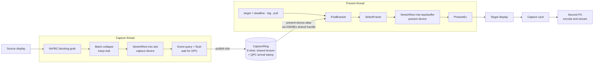
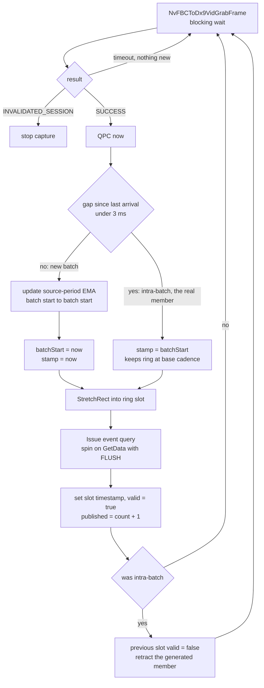
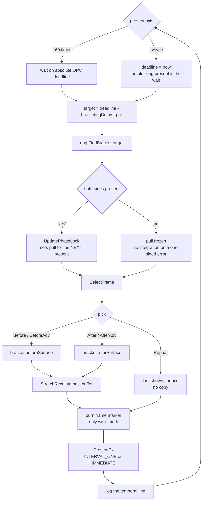
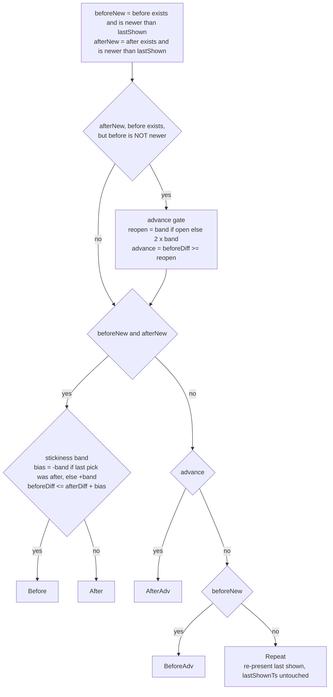

# NvFBC Relay

Captures one display with NvFBC and presents it on another one. There's no
encoder, no application hook, and nothing leaves the D3D9 context.

If the target display is a capture card, the output ends up on whatever is
plugged into the other end of that card, usually a second PC doing the
encoding.

The original version captured and presented on a fixed timer. Most of the work
since then has been frame pacing. The capture clock and the present clock
aren't locked to each other, so just showing the newest frame gives you
duplicates and drops however fast the capture runs. The temporal modes below
choose which captured frame to show at each present.

I use this daily but it's rough. Flags change, and the temporal modes are still
being characterized against real captures.

---

# Prerequisites

As with any application leveraging NvFBC, this is only officially supported
on Tesla & Quadro professional cards. There are other ways to enable NvFBC
on GeForce which are unsupported and definitely not the intended target of
this program.

HDCP also needs to be disabled. Thanks, DRM.

---

# Use

Run `NvFBCR.exe`. It lists your displays and prompts for capture index, target
index, and mode. Or skip the prompts:

```
NvFBCR.exe -source 1 -target 2 -framerate t -src 60 -lock
```

`-source` and `-target` are display indices as listed at startup. `-framerate`
takes a mode:

| Mode | Behavior |
| ---- | -------- |
| `vsync` | Default. Capture and present on the vsync interval. The original relay behavior. |
| `t` or `t:vsync` | Temporal selection, present blocked on DWM's compose clock. The production mode. |
| `t:<fps>` | Temporal selection, present driven by a QPC timer at the given rate. |
| `<fps>` | Plain timer capture at the given rate. No temporal selection. |
| `diag` | Diagnostic clock probe: QPC 60Hz, immediate present. Logs DWM compose timing and card raster per tick. |
| `diag:vsync` | Diagnostic probe on `INTERVAL_ONE`. Present block time measures DWM's delivery cadence. |

Options:

| Option | Effect |
| ------ | ------ |
| `-src <fps>` | The source's real frame rate. Drives the bracketing lag, so setting it correctly matters for pacing. This is always the base render rate, never the displayed rate: with frame generation at 60x2, pass 60. |
| `-lock` | Arms the comb lock. Opt-in. |
| `-mark` | Writes frame markers into the output for offline pacing analysis. See `docs/frame-marker-spec.md`. |

Under a fullscreen game on the source, the card locks the compose clock to
60Hz, so `t:vsync` presents at 60 whatever the source is rendering. On the
desktop there's no such lock and a 240Hz source gives you 240Hz presents.
That's the DWM compose clock showing through, and it confuses people reading
present rates out of a desktop capture.

---

# Architecture

Capture and present run on separate threads, each with its own D3D9Ex device.
They used to share one device and that didn't work. The blocking NvFBC grab
holds the device lock for as long as it waits, which slaved present timing to
capture arrivals. Measured present jitter came out at half a capture period.

Ring slots are render target textures created on the capture device and opened
on the present device through D3D9Ex shared handles, so the present thread
never touches the capture device. D3D9Ex shared surfaces have no cross-device
sync primitive, so ordering here relies on driver behavior. If the output ever
shows tearing or partial frames inside a slot, that's the cause.



## Capture thread

The grab blocks until the source delivers a frame, so the arrival stamps are
real arrival times and not poll times.

Batch collapse is the awkward part. Under NVIDIA Smooth Motion the grab wakes
about twice per base frame and the two wakes land less than 3ms apart. Wake
order measures as generated first, real second, so the intra-batch wake is the
real frame. That one gets stamped with the batch start time and published, then
the previous slot gets retracted. Real content doesn't produce sub-3ms gaps.
You'd need a 333fps base rate for that, and non-FG 240Hz gaps are 4.17ms.



Retraction only clears the valid flag, never the contents, so a present already
reading that slot stays coherent.

## Present loop

The selection target sits a fixed bracketing lag behind the present deadline.
The lag is 1.25x the assumed source period, floored at the present period, and
it's fixed at launch. Keeping it fixed is deliberate. An adaptive lag means
output latency nobody downstream can compensate for. `-src` is what sizes it.
The ring keeps its own source period estimate, but that's telemetry for
auditing your `-src` and it never steers the lag.



---

# How temporal selection works

The relay keeps a ring of captured frames, each stamped with the QPC time its
grab returned. At every present it computes a selection target, finds the two
ring frames bracketing that target, and picks one:

* Nearest side wins. A Schmitt hysteresis band keeps a target that's sitting
  near the midpoint from flip-flopping between the two frames every present,
  which you'd see as judder.
* An advance gate stops it skipping a frame that hasn't been shown yet when
  only the after side is newer.
* If nothing in the ring is newer than what was last shown, it re-presents the
  last surface instead of copying anything.



Those six outcomes are the `Pick` enum. Their integer values are frozen,
because they're the 3-bit pick code burned into every `-mark` recording. New
outcomes can only be appended.

With `-lock`, a closed-loop control step runs on top of selection. Arrivals
from the source land on a comb of repeating phases; the lock measures the
error against that comb and adds a small extra lag ("pull") to hold the
selection target on a stable tooth. It filters with an EMA, gates on stability,
slews the pull symmetrically under a bound, and wraps modulo the comb behind a
hysteresis band. It freezes rather than integrating when a bracket is
one-sided, so gaps do not poison the loop.

The decision logic lives in `TemporalPolicy.{h,cpp}` as plain arithmetic over
explicit state structs. It has no `windows.h`, no `d3d9.h`, and no clocks: it
is deterministic, unit-agnostic (QPC ticks in production, microseconds in
tests), and compiles anywhere, which is what makes it testable. The capture
mode owns the wiring; the policy owns the decisions.

---

# Frame markers

`-mark` burns a machine-readable strip into the top-left corner of every
presented frame. It's debug output, not something to leave on for a real
stream.

Before markers, lining a recorded video up against the relay log meant guessing
a time offset from capture stalls or scene changes and then trusting that guess
for the whole file. Now you read the number off the frame and look up the log
line with the same `mark=` value.

## What gets burned

44 cells in one row, each pure black or pure white, LSB-first within each
field.

| cells | field | encoding |
| ----- | ----- | -------- |
| 0 | sync | always white, means "a marker is here" |
| 1-24 | frame counter | 24-bit, wraps at 2^24, about 74 hours at 60fps |
| 25 | interp flag | reserved, black for now |
| 26-29 | weight | round(w * 15), the bracket weight |
| 30-31 | compositor ID | reserved, black means nearest |
| 32-33 | source provenance | reserved, black |
| 34-36 | pick code | 0 none, 1 before, 2 after, 3 after-adv, 4 before-adv, 5 repeat |
| 37-39 | extension schema | 0 means core layout only |
| 40-43 | checksum | 4-bit XOR fold of the 39 payload bits |

Two real strips, `#` for white and `.` for black:

```
#...#.#####.................##.....#.......#   counter=1000  w=12  pick=2 (after)
##..#.#####.................##....#.#...###.   counter=1001  w=12  pick=5 (repeat)
```

The reserved cells are drawn black rather than left out, so the layout and the
decoder never have to change when the blend work lands.

## Geometry and why it survives compression

The strip is those 44 cells plus a one-cell black quiet zone on every side, so
a 46x3 grid. It gets blitted at 60 cells per output width, which works out to
32px cells on a 1920-wide output. The position is a fraction of the frame
rather than absolute pixels, so cropping or rescaling between the capture card
and the analysis file doesn't move it.

Cells are pure luma black and white. Chroma is 4:2:0 subsampled and lossy. Luma
is full resolution and comes through a Twitch transcode plus a download and a
re-encode intact. At 32px a cell covers several 16x16 macroblocks, so it
survives as more or less a DC coefficient even at high QP. That's also the
reason this isn't a QR code. The payload is a fixed 39 bits, both ends are
ours, and coarse flat cells beat QR's small modules through compression. The
error correction idea is still there, just as a checksum plus counter
monotonicity.

Decoding samples the middle 50% of each cell so edge bleed doesn't matter,
checks cell 0 is white, and validates the checksum.

## Why it's burned on the present side

The marker goes onto the backbuffer after the content copy and before
`PresentEx`. It never touches ring or capture surfaces, which are shared and
get re-presented whenever the pick is a repeat.

That placement is what makes duplicate attribution work from video alone. A
duplicate introduced downstream copies the entire frame including the burned
cells, so the same counter shows up twice. A relay repeat burns a fresh marker
with a new counter and pick 5. So when two video frames have identical content,
the counter tells you which layer produced the duplicate: same counter means
something downstream did it, different counter with pick 5 means the relay did.

The counter also advances when drawing is disabled or fails. That keeps `mark=`
in the log a pure present count, so a mid-run draw failure can't shift the join
for frames already recorded.

---

# Docs

Design specs for the non-obvious parts:

| Spec | Covers |
| ---- | ------ |
| [`docs/policy-extraction-spec.md`](docs/policy-extraction-spec.md) | Pulling the decision logic out into a testable unit |
| [`docs/phase-comb-lock-spec.md`](docs/phase-comb-lock-spec.md) | The comb lock control loop |
| [`docs/adaptive-bracketing-delay-spec.md`](docs/adaptive-bracketing-delay-spec.md) | Bracketing lag as a function of source rate |
| [`docs/frame-marker-spec.md`](docs/frame-marker-spec.md) | The `-mark` marker encoding, for offline analysis |
| [`docs/dual-device-capture-present-spec.md`](docs/dual-device-capture-present-spec.md) | Splitting capture and present across two D3D devices |
| [`docs/init-cleanup-spec.md`](docs/init-cleanup-spec.md) | Startup and teardown ordering |

---

# In progress

Work on branches, not yet merged to `dev`:

* `etw-frame-timing` - reading real scanout times in-process from ETW flip
  events, cross-checked against DxgKrnl VSync DPCs, plus a D3D11 flip-model
  present backend and a replay harness that runs the production policy against
  recorded traces offline.
* `nvofa-warp` - synthesizing intermediate frames with optical flow when
  neither bracket neighbour lands cleanly.

---

# Building

Clone the repo, open `samples/NvFBC/NvFBCR/NvFBCR_2013.vcxproj` in VS2022, and
build. CI builds on push (`.github/workflows/dev-build.yml`), so the artifact
from a green run is usually easier than building locally.

---

# Note about Display coordinates

Displays can be oriented in any fashion, but we don't do any automatic checking
of output dimensions during runtime. So starting NvFBC and then starting an application fullscreen in a different resolution may 
cause the coordinate of the output window to break if the target display's coordinate is dependent on the capture display.

In other words, if your target display is to the right/below the capture display, window offset bugs will occur when changing resolutions.

Place the target display to the left of the capture display or keep the capture display at a static resolution.

---

# Why?

TL;DR higher FPS lower latency (mostly)

Assuming you do not want to or cannot use HDMI passthrough on a capture card (personally, I 
need to use DisplayPort to get the most out of my monitor), there are 
basically 3 ways to do screen capture in Windows, and the functions of these exist on two axes.\
The first axis is capture method - NvFBC vs. DXGI duplication. NvFBC is unsupported on modern 
Windows but provides lower capture latency and smaller performance cost in the typical case 
than DXGI.\
The second axis is available output formats. The typical use case is to directly encode output
to a local video file or stream. Using dedicated capture hardware can provide better flexibility
and lessen the performance impact on the capture system.

| Capture Method | Performance Cost | Positives | Negatives |
| ------ | ------ | ------ | ------ |
| OBS | 8-15% | Very flexible outputs, HDR support everywhere | Overall performance cost
| DXGI & Capture Card | 5-7% | Lowest performance impact for HDR streaming | Heavy performance cost for what is essentially just a screen copy
| Shadowplay | ~5% | Lowest performance impact for HDR recording | Cannot stream at all from an HDR source, input latency induced by desktop capture mode, need to login to Nvidia & link accounts to use
| NvFBCR | 2-3% | Lowest total performance impact, requires no application hook, can view an HDR source | Output clamped to SDR can cause HDR sources to look washed out, but restorable in post-processing

### OBS
The first method is to use some dedicated capture or streaming software to 
record or transmit without additional hardware. This is something like OBS
or XSplit, and the most common these days. This works well for many people,
but it's the highest performance impact on the system under capture. \
First, these software suites use DXGI capture.\
Second, directly encoding on the capture system is expensive, though lessened significantly by
dedicated encoding ASICs aboard modern GPUs. \
Still, this performance impact 
as tested on a RTX 4090 can be between 8-10% when using OBS with new NVENC H.264/H.265 for local 
capture. It can be up to 15% when combined with tonemapping to SDR and streaming. These figures were
found using application capture mode, and not all 
applications play nicely with application capture. The 
performance penalty is even greater than this when using 
desktop capture.


### DXGI & capture card
The second way is to use DXGI duplication with a capture card.
This is basically where the capture card acts like a second display output 
and you just use Windows display settings to clone your primary display to
the capture card. This is limited in the fact that HDR cannot be enabled
on either display on this mode, meaning that you are stuck in SDR not only in the capture 
stream but also on the primary viewing monitor. You can get around this by extending 
the capture card as a side display instead of setting it as a clone of the primary, then using 
software like OBS to capture the primary and re-present to the capture card. This nullifies 
the performance penalty of encoding when paired with a separate PC, but still uses DXGI
and presents through the OBS rendering pipeline. This is, however, the only way to get
HDR output to a capture card currently without using HDMI passthrough as far as I can tell.\
About 5-7% performance impact.

### Shadowplay
The third way is Shadowplay. Shadowplay uses NvFBC for capture and can perform encoding without 
the captured frame ever leaving VRAM. It is highly performant and will capture HDR to local 
recordings. It will not, however, automatically tonemap HDR capture to SDR for streaming, instead 
just refusing to start. You are also required to use GeForce Experience to utilize Shadowplay.\
About 5% performance impact for local recording. Slightly higher for streaming. Slightly higher performance impact and much higher input 
latency when using desktop capture.

## NvFBCR
NvFBC-Relay lies somewhere between these other options in features and flexibility while being the
clear-cut performance winner in almost all scenarios. It's incredibly simple in design, as all it 
does is capture direct to a DX9 surface that is already set up as the backbuffer for a window.
It is basically a copy, a pointer swap, and 2 more copies:

* Capture and write to backbuffer - scaling is done in hardware by NvFBC
* Flip backbuffer to front with Present call
* Blt copy front buffer to DWM surface
* DWM renders to screen

No shared memory resources are ever explicitly utilized, everything stays in DX9 context like 
Shadowplay does. The GPU itself does nearly zero work since no rendering resources are utilized;
we don't even initialize a DX9 rendering pipeline, it's just there to hold the surface and swap 
chain. \
This simplicity comes with drawbacks. \
The most obvious one is that we consider it outside our scope to provide an encoder;
we explicitly do not want to use NVENC because it has a nonzero,
though small, performance impact. Encoding the output stream is left to the capture card host.\
DX9 has no capability to output HDR, and while
it does seem possible to utilize a shared surface to pass the NvFBC output to DX11, there doesn't
seem to be any easy way to directly present a surface in DX11 aside from rendering it as a texture,
which both greatly increases complexity and probably throws away all performance benefits at these 
small margins.\
That means that while NvFBCR will capture a display outputting HDR, it will only output on an SDR
surface.\
Frame delivery pacing could be better and tearing is allowed for lowest performance impact.\
Additionally, I have observed a much larger performance impact than is typical using NvFBC in both 
NvFBCR and in Shadowplay specifically in Horizon: Zero Dawn. I've found no other application to 
exhibit this apparent CPU-related regression, but HZD also has a weird bug where ReBAR causes 
CPU-related performance regressions on Intel platforms in this game, so I think this is just an 
outlier where Nvidia's driver really hates this game.


There are some unique benefits to NvFBC-Relay in comparison to the existing options.

* Its performance is the best of the options in most scenarios, typically 2-3% performance impact. 
* It provides great flexibility with the output stream. Since NvFBCR outputs to any arbitrary display, 
a capture card can be used to take this output and manipulate it as desired on a separate system. This removes
some painful limitations like Shadowplay being unable to
stream HDR sources.
* Capture is entirely agnostic of running games and does not rely on application hooks, 
and will capture the desktop without increasing performance impact like OBS or input latency like Shadowplay.


---

# Credits

The original NvFBC relay, and the comparison analysis above, are Collin
Blakley's work. His commits are in the history.

---

# License

The code in `samples/NvFBC/NvFBCR/`, `samples/NvFBC/NvFBCEnable/` and
`samples/Common/` is MIT, see `LICENSE`. The one exception is `NvFBCR.cpp`,
which still holds code from the original relay. That project shipped without a
license, so those lines carry no grant and the file sits outside the MIT scope
until Collin agrees to relicense.

This repo started as the NvFBC sample from the NVIDIA Capture SDK and still
has the SDK's layout, so the NvFBC headers in `inc/NvFBC/` and the helpers in
`samples/Util/` are NVIDIA's and stay under NVIDIA's terms. `THIRD-PARTY.md`
lists exactly what came from where, and what the plan is for getting it out of
the tree.
