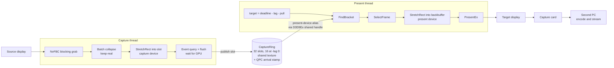
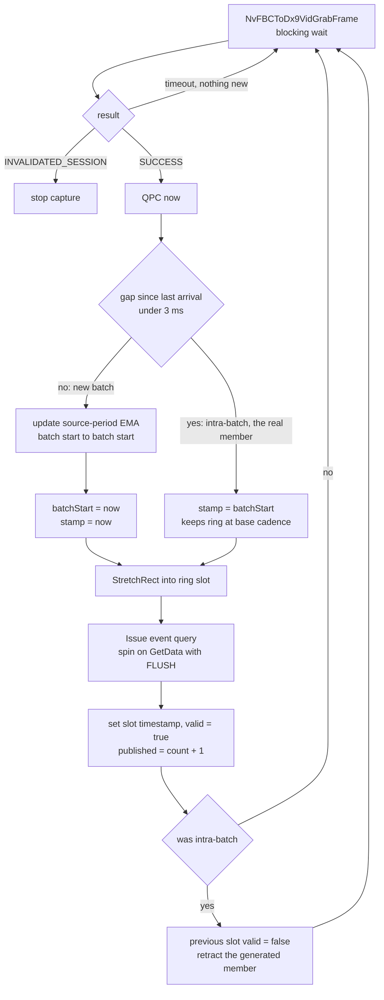
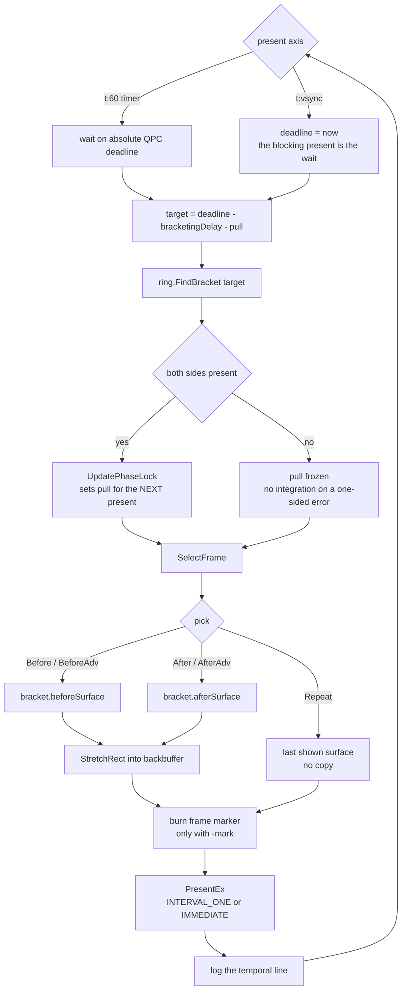
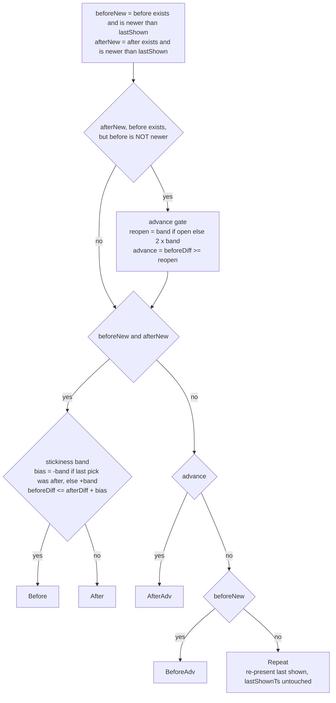

# NvFBC Relay

NvFBCR shows one display's picture on another, captured with NVIDIA's NvFBC.
The game PC runs no encoder and hooks into no game, and every frame stays on
the graphics card from capture to output.

Point it at a capture card and the picture lands on whatever is plugged into
the card's other end, usually a second PC that does the encoding.

The original version captured and presented on a fixed timer. Most of the work
since then has been frame pacing. The capture clock and the present clock
aren't locked to each other, so just showing the newest frame gives you
duplicates and drops however fast the capture runs. The temporal modes below
choose which captured frame to show at each present.

I use this daily but it's rough. Flags change, and the temporal modes are still
being characterized against real captures.

---

# Prerequisites

NVIDIA documents NvFBC, its capture interface, for its professional cards.

HDCP copy protection has to be off on the game display for NvFBC to capture it.

NvFBCR needs an NVIDIA graphics card and driver. It uses two files the driver
installs in `C:\Windows\System32`, `NvFBC64.dll` for capture and
`nvofapi64.dll` for optical flow. If either one is reported missing, update or
reinstall the NVIDIA driver.

The exe asks for administrator rights when it starts. Enabling NvFBC on a
machine where it is off needs them, and so does reading frame timing from the
graphics driver, which the relay does by default. `NvFBCEnable.exe`, the tool
that turns NvFBC on and off, asks for them too.

## Windows Defender

Windows Defender sometimes flags `NvFBCEnable.exe` as
`Trojan:Win32/Sabsik.FL.A!ml`. That's a false positive from Defender's
machine-learning detection, which the `!ml` at the end marks.
NvFBCEnable's source is in `tools/NvFBCEnable/`, and it hadn't changed
in months when the detection first appeared.

If it happens, add a Defender exclusion for the folder you run the relay from.
Reporting the file to Microsoft as a false positive at
https://www.microsoft.com/wdsi/filesubmission helps too. The builds aren't
code-signed. A signing certificate costs more than this project can justify.

---

# Use

Run `NvFBCR.exe`. It lists your displays and asks for the game display, the
capture card display, and a mode. Press Enter at the mode prompt for the
default, `b:vsync`. Options go on the same line after the mode, for example
`b:vsync -src 90`, or on their own for the default mode, `-src 90`. An answer
the relay can't use gets a line saying why, and the question again.

## Shortcuts

To skip the prompts, put everything on the command line. A Windows shortcut
works well for this. Right-click `NvFBCR.exe`, choose Create shortcut, open the
shortcut's Properties, and add the options to the end of Target, after the
closing quote:

```
"C:\path\to\NvFBCR.exe" -source 0 -target 1 -src 60
```

`-source` is the game display and `-target` the capture card display, numbered
as the relay lists them at startup. Leave out `-framerate` to get the default
mode, or add `-framerate <mode>` to pick another. Windows asks for
administrator rights each time, because the relay needs them.

The relay uses a command line only when all of it works. Anything it can't use,
a mistyped mode or option or a display number that no longer exists, sends it
back to asking, with a line saying what was wrong, and nothing from that command
line is kept. Display numbers can change when you add or remove a display or
update the graphics driver. A number that now points at a different display
captures that display instead,
so after a change like that, run the relay once without the shortcut and check
its list.

## Modes

`-framerate` takes a mode, and so does the mode prompt:

| Mode | Behavior |
| ---- | -------- |
| `vsync` | Capture and present on the vsync interval. The original relay behavior. |
| `t` or `t:vsync` | Temporal selection, present blocked on DWM's compose clock. |
| `t:<fps>` | Temporal selection, present driven by a QPC timer at the given rate. |
| `b` or `b:vsync` | Temporal blend (sharp passthrough when a real frame sits on the target, a lerp of the bracket pair otherwise), presented through a D3D11 flip-model swapchain on the capture card's own vblank. The default. |
| `b:dwm` | The same blend on the D3D9 swapchain, present blocked on DWM's compose clock. The path `t` runs on. |
| `b:<fps>` | The same blend, present driven by a QPC timer at the given rate. |
| `<fps>` | Plain timer capture at the given rate. No temporal selection. |
| `diag` | Diagnostic clock probe: QPC 60Hz, immediate present. Logs DWM compose timing and card raster per tick. |
| `diag:vsync` | Diagnostic probe on `INTERVAL_ONE`. Present block time measures DWM's delivery cadence. |

Under a fullscreen game on the source, the card locks the compose clock to
60Hz, so `t:vsync` presents at 60 whatever the source is rendering. On the
desktop there's no such lock and a 240Hz source gives you 240Hz presents.
That's the DWM compose clock showing through, and it confuses people reading
present rates out of a desktop capture.

## Options

| Option | Effect |
| ------ | ------ |
| `-src <fps>` | The game's own frame rate, not counting frames added by DLSS Frame Generation or Smooth Motion. Default 60. See Choosing `-src` below. |
| `-lag <ms>` | Extra delay added to the relayed video, 0 to 200 ms, default 75. More delay means fewer repeated frames. The player never feels it. The stream just runs slightly later. |
| `-mark [N]` | Debug. Burns a frame counter into the output for offline analysis, the first N frames only when N is given. See Frame markers below. |

### Choosing `-src`

Set `-src` to the frame rate the game itself renders. Frames added by frame
generation don't count. If DLSS Frame Generation or Smooth Motion doubles a game
to 120 FPS, use `-src 60`.

If the frame rate varies, bias lower. For a game running mostly 75 to 90 FPS,
use `-src 80`, not 90. Set too high, the relay blends more frames exactly when
the game dips, which is where a blended frame's double image is easiest to see.

Without `-src` the relay assumes 60.

### Defaults

The relay's frame pacing features are all on by default. It locks onto the
game's frame timing, adds the 75 ms of extra delay above, and reads frame timing
from the graphics driver to correct frames that arrive late. None of them costs
anything measurable (see Present paths). For troubleshooting, each can be
turned off.

| Option | Turns off |
| ------ | --------- |
| `-nolock` | Locking onto the game's frame timing, and with it the late-frame correction |
| `-noetw` | Reading frame timing from the graphics driver, and with it the late-frame correction |
| `-nodejit` | The late-frame correction only |
| `-lag 0` | The extra delay |

The older spellings `-lock`, `-etw` and `-dejit` still work and change nothing.
If the relay can't read frame timing from the driver, it says so once and keeps
running without the late-frame correction.

## Logging

Logging is off unless a file named `NvFBCR.log` exists beside `NvFBCR.exe`.
Create an empty one to turn logging on. Each launch overwrites it, except the
restart that follows the relay turning NvFBC on, which carries on in the same
file. The log is
for diagnosing problems, and a long session can write about 160 MB an hour.

## Video delay and audio sync

NvFBCR relays video only. Audio through the relay is planned but not there yet.

To pace frames evenly, the relay holds the picture back briefly. At the
defaults that's between 95 and 113 ms, about 104 ms typically, measured over 90
minutes of gameplay. A lower `-src` holds it longer, about 20 ms more at
`-src 30`, and each ms of `-lag` adds one ms.

Audio that reaches the capture card some other way doesn't get that hold, so it
can arrive ahead of the picture. How far ahead depends on the audio's own route,
which adds delay of its own. Fix it in OBS by delaying the capture card's audio.
In the Audio Mixer, open the audio source's menu, choose Advanced Audio
Properties, and set its Sync Offset. A positive value delays the audio.

With system audio sent over the card's HDMI by Elgato Wave Link, about 20 ms
has looked right, which suggests the route itself adds most of the relay's delay. For a
different route, start there and adjust by eye, or with a sync test video that
flashes and beeps together.

## 1440p output

The relay outputs at the capture card display's resolution, so for 1440p set
the card to 2560x1440 in Windows display settings. It costs the game no more
than 1080p does.

Use a mode that runs at exactly 60.000 Hz. The standard 2560x1440 "60 Hz" mode
many cards offer really runs at 59.95 Hz. Against a 60 FPS game that means a
skipped frame about every 20 seconds, plus a repeated one where the stream fills
back up to 60. An NVIDIA custom resolution fixes it. In the NVIDIA Control
Panel, under Change resolution, choose Customize, create a 2560x1440 mode at
60 Hz, test it, then select that custom entry. On an EVGA XR1 Pro the custom
mode measures within a thousandth of a hertz of 60.

To check which one is running, the relay log's `Display mode on adapter` line
reads `@60Hz` for the custom mode and `@59Hz` for the 59.95 Hz one.

## Present paths

The blend mode has two ways to reach the screen, and the name says which clock
the present rides. `b:vsync` presents through a D3D11 flip-model swapchain on
the output window; Windows promotes it to independent flip, so the present
blocks on the capture card's own vblank. `b:dwm` presents through the D3D9
swapchain, blocked on DWM's compose clock, which is the path `t` runs on. Under in-game frame generation that clock runs at the displayed rate, two
presents per source frame into a 60Hz sink, and the recording shows it.

Measured in one session, Avatar 60x2 with in-game frame generation,
`-src 60 -lock -lag 75 -mark -etw -dejit`, inside the benchmark tests:

| | `b:dwm` (D3D9, DWM compose clock) | `b:vsync` (D3D11 flip model, sink vblank) |
| --- | --- | --- |
| presents/s on the 60Hz sink | 117 to 120 | 60.00 |
| present spacing stdev | 575 to 2076 us | 20 to 97 us |
| comb lock engaged | 0.0% | 100% |
| hold-comb/s | 53 to 60 | 0 |
| content repeats/s in the recording (mean) | 3.55 (worst test 14.27) | 0 |
| PresentMon presentation mode | Composed | Hardware: Independent Flip (99.2%) |
| KCD2 anomalies/min (real gameplay) | 0.30 | 0.10, all inside a map close |

What each mode costs the game, from a separate benchmark session. Avatar
uncapped with DLSS frame generation keeps the GPU fully loaded, so any cost the
relay adds shows up in the benchmark score.

| Mode | Flags | Score lost |
| ---- | ----- | ---------- |
| relay not running | | none (baseline) |
| `vsync` | | 8.3% |
| `b:dwm` | `-src 60` | 9.4% |
| `b:vsync` | `-src 60` | 5.4% |
| `b:vsync` | `-src 60 -lock -lag 75 -etw -dejit`, today's defaults | 5.6% |

`b:vsync` costs least because it presents only as often as the card can show,
60 times a second. `b:dwm` presented 137 times a second and DWM copied every
one. The lock, the extra lag and the late-frame correction together cost less
than the benchmark can measure, and 1440p output costs no more than 1080p. The
full numbers are in [`docs/relay-cost-results.md`](docs/relay-cost-results.md).

---

# Architecture

Capture and present run on separate threads, each with its own D3D9Ex device.
They used to share one device and that didn't work. The blocking NvFBC grab
holds the device lock for as long as it waits, which slaved present timing to
capture arrivals. Measured present jitter came out at half a capture period.

Ring slots are render target textures created on the capture device and opened
on the present device through D3D9Ex shared handles, so the present thread
never touches the capture device. D3D9Ex shared surfaces have no cross-device
sync primitive, so ordering here relies on driver behavior. If the output ever
shows tearing or partial frames inside a slot, that's the cause.



## Capture thread

The grab blocks until the source delivers a frame, so the arrival stamps are
real arrival times and not poll times.

Batch collapse is the awkward part. Under NVIDIA Smooth Motion the grab wakes
about twice per base frame and the two wakes land less than 3ms apart. Wake
order measures as generated first, real second, so the intra-batch wake is the
real frame. That one gets stamped with the batch start time and published, then
the previous slot gets retracted. Real content doesn't produce sub-3ms gaps.
You'd need a 333fps base rate for that, and non-FG 240Hz gaps are 4.17ms.



Retraction only clears the valid flag, never the contents, so a present already
reading that slot stays coherent.

## Present loop

The selection target sits a fixed bracketing lag behind the present deadline.
The lag is 1.25x the assumed source period, floored at the present period, and
it's fixed at launch. Keeping it fixed is deliberate. An adaptive lag means
output latency nobody downstream can compensate for. `-src` is what sizes it.
The ring keeps its own source period estimate, but that's telemetry for
auditing your `-src` and it never steers the lag.



---

# How temporal selection works

The relay keeps a ring of captured frames, each stamped with the QPC time its
grab returned. At every present it computes a selection target, finds the two
ring frames bracketing that target, and picks one:

* Nearest side wins. A Schmitt hysteresis band keeps a target that's sitting
  near the midpoint from flip-flopping between the two frames every present,
  which you'd see as judder.
* An advance gate stops it skipping a frame that hasn't been shown yet when
  only the after side is newer.
* If nothing in the ring is newer than what was last shown, it re-presents the
  last surface instead of copying anything.



Those six outcomes are the `Pick` enum. Their integer values are frozen,
because they're the 3-bit pick code burned into every `-mark` recording. New
outcomes can only be appended.

With `-lock`, a closed-loop control step runs on top of selection. Arrivals
from the source land on a comb of repeating phases; the lock measures the
error against that comb and adds a small extra lag ("pull") to hold the
selection target on a stable tooth. It filters with an EMA, gates on stability,
slews the pull symmetrically under a bound, and wraps modulo the comb behind a
hysteresis band. It freezes rather than integrating when a bracket is
one-sided, so gaps do not poison the loop.

The decision logic lives in `TemporalPolicy.{h,cpp}` as plain arithmetic over
explicit state structs. It has no `windows.h`, no `d3d9.h`, and no clocks: it
is deterministic, unit-agnostic (QPC ticks in production, microseconds in
tests), and compiles anywhere, which is what makes it testable. The capture
mode owns the wiring; the policy owns the decisions.

---

# Frame markers

`-mark` burns a machine-readable strip into the top-left corner of every
presented frame. It's debug output, not something to leave on for a real
stream.

Before markers, lining a recorded video up against the relay log meant guessing
a time offset from capture stalls or scene changes and then trusting that guess
for the whole file. Now you read the number off the frame and look up the log
line with the same `mark=` value.

## What gets burned

44 cells in one row, each pure black or pure white, LSB-first within each
field.

| cells | field | encoding |
| ----- | ----- | -------- |
| 0 | sync | always white, means "a marker is here" |
| 1-24 | frame counter | 24-bit, wraps at 2^24, about 74 hours at 60fps |
| 25 | interp flag | reserved, black for now |
| 26-29 | weight | round(w * 15), the bracket weight |
| 30-31 | compositor ID | reserved, black means nearest |
| 32-33 | source provenance | reserved, black |
| 34-36 | pick code | 0 none, 1 before, 2 after, 3 after-adv, 4 before-adv, 5 repeat |
| 37-39 | extension schema | 0 means core layout only |
| 40-43 | checksum | 4-bit XOR fold of the 39 payload bits |

Two real strips, `#` for white and `.` for black:

```
#...#.#####.................##.....#.......#   counter=1000  w=12  pick=2 (after)
##..#.#####.................##....#.#...###.   counter=1001  w=12  pick=5 (repeat)
```

The reserved cells are drawn black rather than left out, so the layout and the
decoder never have to change when the blend work lands.

## Geometry and why it survives compression

The strip is those 44 cells plus a one-cell black quiet zone on every side, so
a 46x3 grid. It gets blitted at 60 cells per output width, which works out to
32px cells on a 1920-wide output. The position is a fraction of the frame
rather than absolute pixels, so cropping or rescaling between the capture card
and the analysis file doesn't move it.

Cells are pure luma black and white. Chroma is 4:2:0 subsampled and lossy. Luma
is full resolution and comes through a Twitch transcode plus a download and a
re-encode intact. At 32px a cell covers several 16x16 macroblocks, so it
survives as more or less a DC coefficient even at high QP. That's also the
reason this isn't a QR code. The payload is a fixed 39 bits, both ends are
ours, and coarse flat cells beat QR's small modules through compression. The
error correction idea is still there, just as a checksum plus counter
monotonicity.

Decoding samples the middle 50% of each cell so edge bleed doesn't matter,
checks cell 0 is white, and validates the checksum.

## Why it's burned on the present side

The marker goes onto the backbuffer after the content copy and before
`PresentEx`. It never touches ring or capture surfaces, which are shared and
get re-presented whenever the pick is a repeat.

That placement is what makes duplicate attribution work from video alone. A
duplicate introduced downstream copies the entire frame including the burned
cells, so the same counter shows up twice. A relay repeat burns a fresh marker
with a new counter and pick 5. So when two video frames have identical content,
the counter tells you which layer produced the duplicate: same counter means
something downstream did it, different counter with pick 5 means the relay did.

The counter also advances when drawing is disabled or fails. That keeps `mark=`
in the log a pure present count, so a mid-run draw failure can't shift the join
for frames already recorded.

---

# Docs

Design specs for the non-obvious parts:

| Spec | Covers |
| ---- | ------ |
| [`docs/policy-extraction-spec.md`](docs/policy-extraction-spec.md) | Pulling the decision logic out into a testable unit |
| [`docs/phase-comb-lock-spec.md`](docs/phase-comb-lock-spec.md) | The comb lock control loop |
| [`docs/adaptive-bracketing-delay-spec.md`](docs/adaptive-bracketing-delay-spec.md) | Bracketing lag as a function of source rate |
| [`docs/frame-marker-spec.md`](docs/frame-marker-spec.md) | The `-mark` marker encoding, for offline analysis |
| [`docs/dual-device-capture-present-spec.md`](docs/dual-device-capture-present-spec.md) | Splitting capture and present across two D3D devices |
| [`docs/application-shell-spec.md`](docs/application-shell-spec.md) | Launch to exit: the prompts and command line, windows, devices, NvFBC, failure popups, teardown |

---

# In progress

Work on a branch, not yet merged:

* `nvofa-warp` - synthesizing intermediate frames with optical flow when
  neither bracket neighbour lands cleanly.

---

# Building

Clone the repo, open `NvFBCR.slnx` in Visual Studio 2026, and build. CI builds when you start it from the Actions tab
(`.github/workflows/dev-build.yml`), and the artifact from a green run is
usually easier than building locally. Pushing a `v*` tag builds and publishes a
release (`.github/workflows/release.yml`).

`NvOFFRUC.dll` is never included in this repo or its builds. NVIDIA's
DesignWorks SDK license, which it ships under, grants no right to redistribute
it, and `NvFBCR.exe` doesn't need it to start.

---

# Display arrangement

The relay places its window over the capture card display once, when it
starts. When the capture card display sits to the right of or below the game
display in Windows' display settings, a game that changes the game display's
resolution also moves the capture card display across the desktop, and the
window stays where it was. Put the capture card display to the left of the game
display, or keep the game display at one resolution while the relay runs.

---

# Credits

This project began as Collin Blakley's NvFBC-Relay,
<https://gitlab.com/DonnerPartyOf1/nvfbc-relay>. His commits are in the history.

---

# License

Everything in this repo is MIT, see `LICENSE`, except the two NVIDIA optical
flow headers in `third_party/nvof/`, which keep their own MIT notice.
`THIRD-PARTY.md` lists what came from where.
